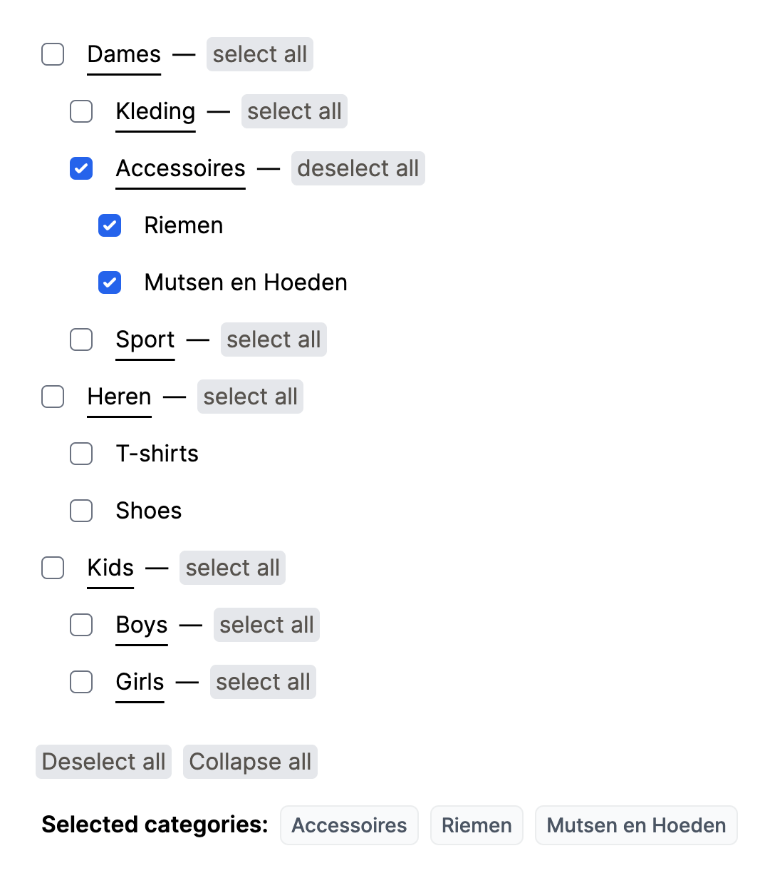

## TODO

- [x] Add a screenshot of your final outcome
- [ ] Add tests
- [ ] Update readme

## Background

Facets are subset of filtering and help users to quickly refine their options
without losing their way or ending up scrolling on irrelevant products.
In this exercice you are going to build a checkbox tree facet component using react.

Given a server response the ui should display a tree of checkboxes with name and quantities
of the brand category similar to `preview.png` attached to this exercice.

(preview.png)

---

Use `response.json` attached to this exercice as a server response to build the facet component.
the root category is gender and has a attribute `parent: "0"`.
Feel free to import the file as it in your solution or wrap it with a promise.

---

### Task

1 - Build an ui tree of checkboxes to represent the tree of categories given by `response.json`

2 - Modify the code to show initially only the parent category checkboxes then add toggle to show children.
if the user clicks `Kleding` it should show all the children of `Kleding` and so on.

3 - Add selected category functionality to show selected categories.

4 - Add remove selected category and add remove-all selected categories functionalities.

5 - On each of the child categories, add `select all` checkbox which select all the subtree of categories
example: `select all` checkbox can select all items underneath `Kleding` and so on.

**Requirements and bonus**

- Work should be structured, including a readme.
- Add a screenshot of your final outcome
- Bonus for slick and concise ui with re-usable components
- Bonus for testing.
